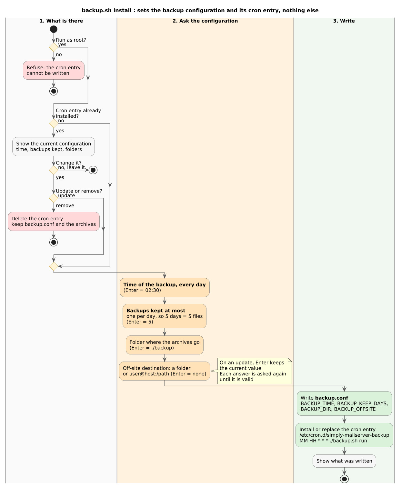
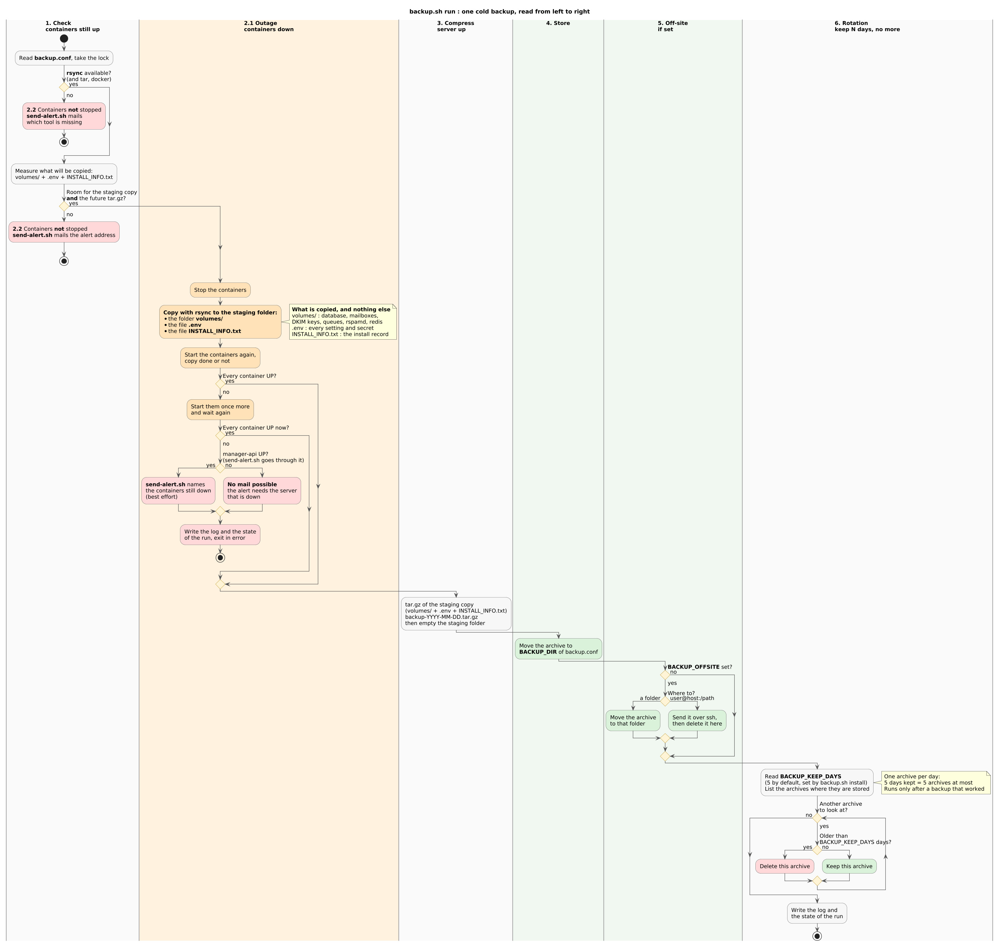

# Backup

How `backup.sh` works: a cold backup of everything the server needs to come
back, taken once a day, rotated by age and optionally shipped to another
server.

> This page describes the design of the backup script. The script itself is not
> part of the repository yet; `scripts/send-alert.sh`, which it calls to warn the
> administrator, already is.

## Install: the configuration and the cron entry



`./backup.sh install`, run as root, has one job: define the configuration of
the backup and its cron entry. It checks neither the disk nor the tools, which
every run does for itself.

1. **What is there**: with no cron entry yet, it goes straight to the
   questions. With one already installed, it shows the current configuration
   and offers to leave it, update it or remove it. Removing deletes the cron
   entry and keeps `backup.conf` and the archives.
2. **Ask the configuration**: the time of the backup, every day (02:30 by
   default); how many backups are kept at most, one per day, so 5 days means 5
   files (5 by default); the folder where the archives go; an optional off-site
   destination, a folder or `user@host:/path`. On an update, Enter keeps the
   current value.
3. **Write**: `backup.conf`, then the cron entry that starts `backup.sh run`
   every day at the chosen time, installed or replaced.

## One backup



The diagram follows one run, from left to right. Its settings come from
`backup.conf`, the file `backup.sh install` writes. No key is added to `.env`.

1. **Check**, with the containers still up, two things one after the other:
   `rsync` is available (with `tar` and `docker`), then the disk can hold the
   staging copy of `volumes/`, `.env` and `INSTALL_INFO.txt` **and** the future
   `tar.gz`.
2. Then one of two things:
   - **2.1** both checks pass: the containers are stopped, everything is
     copied to the staging folder with `rsync`, and the containers are started
     again whether the copy worked or not. The run goes on only once every
     container is up; if one stays down after a second start, the failure is
     written to the log and the state of the run. A mail is only attempted
     when the `manager-api` container is up, because `send-alert.sh` goes
     through it: with the server down, no mail can leave.
   - **2.2** one check fails: the containers are **not** stopped, and
     `send-alert.sh` mails the alert address set in the manager, naming the
     missing tool or the room that is missing.
3. **Compress**, with the server already back up: the staging copy becomes
   `backup-YYYY-MM-DD.tar.gz`, then the staging folder is emptied.
4. **Store**: the archive is moved to `BACKUP_DIR`, the folder chosen at
   install.
5. **Off-site**, if `BACKUP_OFFSITE` is set: the archive is moved to another
   folder, or sent over ssh to another server and deleted here, so backups do
   not fill the disk of the mail server.
6. **Rotation**, so there are never more than N backups: every archive in the
   place where they are stored is looked at; one older than `BACKUP_KEEP_DAYS`
   days (5 by default, set by `backup.sh install`) is deleted, the others are kept. With
   one archive per day, 5 days kept means 5 archives at most. It only runs
   after a backup that worked, then the log and the state of the run are
   written.

The outage only lasts as long as step 2.1.

## Regenerating the diagrams

The sources are [backup-install.plantuml](backup-install.plantuml) and
[backup.plantuml](backup.plantuml). A small container renders
every `.plantuml` or `.puml` file found under `docs/`, at any depth, to a JPEG
next to it, and renders it again each time the file changes:

```sh
docker compose -f docs/docker-compose.diagram.yml up --build
```

Nothing has to be installed on the host: PlantUML, Graphviz and ImageMagick
live in the image (`images/diagrams/`), and `docs/` is bind-mounted into it.
PlantUML writes a PNG, its default format; that PNG never leaves the container,
where it is converted to JPEG then deleted, so only the JPEG appears in `docs/`. A source with a syntax error is reported in the container log and its
previous JPEG is left untouched.

To render without watching:

```sh
docker compose -f docs/docker-compose.diagram.yml run --rm diagrams once   # what is missing or out of date
docker compose -f docs/docker-compose.diagram.yml run --rm diagrams all    # everything again
```
