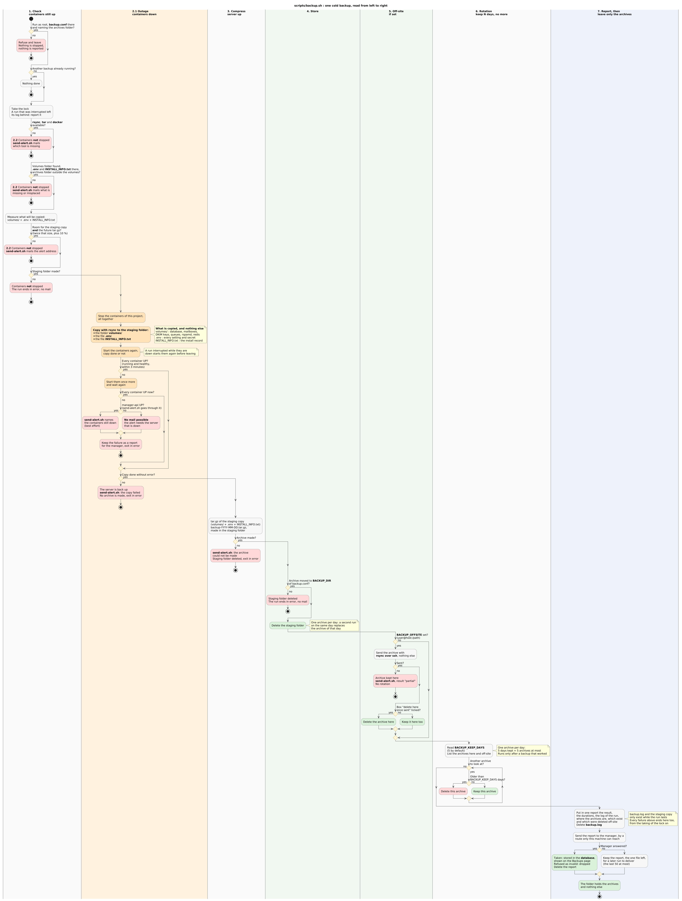
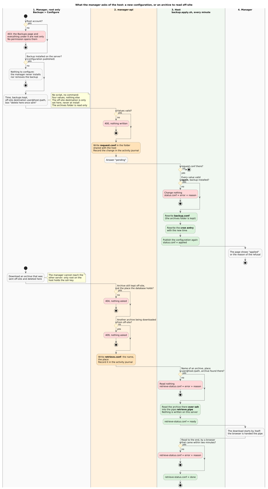

# Backup

A cold backup of everything the server needs to come back: the volumes folder,
`.env` and `INSTALL_INFO.txt`. It is taken once a day, kept for a chosen number
of days, and can be sent off the machine.

Everything lives in `scripts/` and runs as root. `backup.sh`, at the root of
the project, is the one shortcut: it starts the install, and does not run a
backup.

| Script                      | Role                                                                      |
| --------------------------- | ------------------------------------------------------------------------- |
| `backup.sh` (project root)  | shortcut for `scripts/backup.install.sh`, nothing more                    |
| `scripts/backup.install.sh` | sets the configuration and the cron entry, updates them or removes them   |
| `scripts/backup.sh`         | one backup; this is what the cron entry starts every day                  |
| `scripts/backup.apply.sh`   | does what the manager asks: a new configuration, an archive read off-site |

The configuration lives in `backup.conf`, at the root of the project and
ignored by git: it is proper to each server. No key is added to `.env`.

```sh
sudo ./backup.sh         # install, once; then again to change or remove
sudo scripts/backup.sh   # a backup now, without waiting for the cron entry
```

Installing the backup is optional and separate: `install.sh` does not do it.

Once a run has ended, the folder of the archives holds the archives and
nothing else. The result and the log of the run go to the manager, which keeps
them in its database: result, step reached, error, outage and total duration,
log of the run, where the archives are and which exist. `backup.log` and the
staging copy only exist while the run lasts, and the lock lives in `/run/lock`.

## Install: the configuration and the cron entry


`./backup.sh` has one job: define the configuration of the backup and its cron
entry. It checks neither the disk nor the tools, which every run does for
itself.

1. **What is there**: with no cron entry yet, it goes straight to the
   questions. With one already installed, it shows the current configuration
   and offers to leave it, update it or remove it. Removing deletes the cron
   entry and `backup.conf`, and keeps the archives: a later install starts
   again from the default values.
2. **Ask**, three questions and nothing else: the time of the backup, every day
   (02:30 by default); how many backups are kept at most, one per day, so 5
   days means 5 files (5 by default); the folder where the archives go,
   `./backup` by default and stored relative to the project. On an update,
   Enter keeps the current value.
3. **Write**: `backup.conf`, then the cron entry
   `/etc/cron.d/simply-mailserver-backup`, installed or replaced. It holds two
   lines: `scripts/backup.sh` every day at the chosen time, and
   `scripts/backup.apply.sh` every minute. The configuration is also published
   for the manager to read.

The time is the one of the server's clock, whatever its time zone: this is the
clock cron follows. The manager shows it, and takes it, in the time of the
person looking at the page, and says next to it what it is on the server. The
log of a run is stamped in UTC and shown the same way.

Sending the archives to another server is not asked at install: it is set from
the manager. An update made with `./backup.sh` keeps what the manager set.

## One backup



The diagram follows one run, from left to right. Its settings come from
`backup.conf`.

1. **Check**, with the containers still up, two things one after the other:
   `rsync` is available (with `tar` and `docker`), then the disk can hold the
   staging copy of `volumes/`, `.env` and `INSTALL_INFO.txt` **and** the future
   `tar.gz`.
2. Then one of two things:
   - **2.1** both checks pass: the containers are stopped, everything is
     copied to the staging folder with `rsync`, and the containers are started
     again whether the copy worked or not. The run goes on only once every
     container is up; if one stays down after a second start, the run ends
     there and is reported as failed. A mail is only attempted
     when the `manager-api` container is up, because `send-alert.sh` goes
     through it: with the server down, no mail can leave.
   - **2.2** one check fails: the containers are **not** stopped, and
     `send-alert.sh` mails the alert address set in the manager, naming the
     missing tool or the room that is missing.
3. **Compress**, with the server already back up: the staging copy becomes
   `backup-YYYY-MM-DD.tar.gz`, then the staging folder is emptied.
4. **Store**: the archive is moved to `BACKUP_DIR`, the folder chosen at
   install.
5. **Off-site**, if `BACKUP_OFFSITE` is set: the archive is sent to
   `user@host:/path` with `rsync` over ssh, and nothing else. Once sent, it is
   deleted here or kept here too, as `BACKUP_OFFSITE_DELETE_LOCAL` says. If it
   cannot be sent, it stays here, the result is `partial` and the alert address
   is warned.
6. **Rotation**, so there are never more than N backups: every archive, here
   and off-site, is looked at; one older than `BACKUP_KEEP_DAYS` days (5 by
   default) is deleted, the others are kept. With one archive per day, 5 days
   kept means 5 archives at most. It only runs after a backup that worked.
7. **Report, then leave only the archives**: the result and the log of the run
   are put in one report and `backup.log` is deleted. The report is sent to the
   manager by a route only this machine can reach, stored in its database, then
   deleted too. Every failure above ends the same way. A report the manager did
   not take is the one file left, in `.reports/`, until a later run delivers
   it. A run killed before it could end leaves its `backup.log`: the next run
   reports it as interrupted and deletes it.

The outage only lasts as long as step 2.1: the containers are stopped together,
the copy is a local `rsync`, and the same containers are started again in the
order they were first started. What takes longest is waiting for every
healthcheck to pass.

## From the manager



The **Backups** page of the manager (System section) shows the schedule, the
last backup, every run with its log, and every archive with where it is now:
on the server, sent off-site, deleted by the rotation.

The page, its configuration sub-page and every route behind them are **root
only**. No permission opens them and none exists for them: an archive holds
every mailbox and every secret of the server.

- The manager never installs nor removes the backup. Until `./backup.sh` has run
  on the server, the page says so and shows no configuration; the
  archives already known stay listed and downloadable.
- The configuration sub-page changes the time, the number of backups kept, the
  off-site destination and the box "delete the archive from the server once it
  is sent". The off-site destination is only set here, never at install.
- No script and no command can be entered: the off-site step is a fixed `rsync`
  over ssh, and these four values are checked by the manager, then again by
  `scripts/backup.apply.sh` on the host, which rewrites `backup.conf` and the
  cron entry within a minute. The folder of the archives cannot be changed from
  the manager.
- A download uses a link signed for one archive and valid one minute, recorded
  in the activity journal.
- An archive that was sent off-site and deleted from the server is downloaded
  from the other server, and is never written on this one: it takes no room on
  its disk and does not come back into the folder of the archives. The manager
  cannot reach the other server, only root on the host holds the ssh key: so
  the button asks the host. `scripts/backup.apply.sh` checks the name of the
  archive and the place the database holds for it, reads it there over ssh
  into a pipe of the folder it shares with the manager, and the manager hands
  that pipe to the browser. The download starts by itself, within about a
  minute. A request gives one download, one archive at a time; a download
  nobody takes within two minutes is dropped.
- For an archive sent off-site, "there" or "not there" is said of the other
  server: when the list is shown, the manager asks the host to list the
  off-site destination of `backup.conf` over ssh, at most once a minute, and
  the column "Off the server" shows what was found there, with the time of the
  check. "Not there" means the archive was sent and is not on the other server
  anymore; it can then not be downloaded. Until the host has answered, or when
  it cannot reach the other server, the archive is only shown as sent. The
  column "On the server" shows nothing for an archive that is kept off-site
  and not here.
- The database holds where each archive is kept: its folder on the server.
  Presence is never remembered, it is looked up there each time the page is
  shown and before each download. An archive, or its whole folder, that was
  moved away or deleted is shown as not there and cannot be downloaded; put
  back, it is shown as present again. No restart is needed either way: the
  manager sees the project folder itself, read only, and finds the archives
  folder in it by its path.
- With a folder chosen outside the project at install, the manager cannot look
  at it: the archives are listed as the last backup reported them, marked as
  not checked, and cannot be downloaded from the manager.

## Restoring

As root, with the stack stopped:

```sh
tar --extract --gzip --numeric-owner --acls --xattrs --file backup-YYYY-MM-DD.tar.gz -C /some/empty/folder
```

The archive holds `volumes/`, `.env` and `INSTALL_INFO.txt`. Put `volumes/`
back where `VOLUMES_PATH` of `.env` points, the two files at the root of the
project, then start the stack. `--numeric-owner` is mandatory: the files belong
to the user ids of the containers, not to accounts of the host.

## What is not covered

- The archive is not encrypted and holds `.env`, so every secret in clear. It
  is stored with mode `600` in a folder with mode `700`; an off-site server
  must be trusted accordingly.
- A remote destination uses the ssh configuration of root on the server: its
  key, its `known_hosts`, and its `~/.ssh/config` for a port other than 22. The
  manager does not manage them.
- The cron entry starts `scripts/backup.apply.sh` every minute; it leaves at
  once when the manager asked for nothing.
- The other server needs `rsync` installed too, to receive the archives and to
  give one back.
- If the server does not come back up after the copy, no mail can be sent and
  the manager cannot be told: both go through that same server. The run waits
  as a report in `.reports/` of the archives folder and reaches the manager at
  the next run.
- Nothing about a run stays readable on the server once the manager took its
  report: its result and its log are on the Backups page of the manager.

## Regenerating the diagrams

The sources are [backup-install.plantuml](backup-install.plantuml),
[backup-run.plantuml](backup-run.plantuml) and
[backup-manager.plantuml](backup-manager.plantuml). A small container renders
every `.plantuml` or `.puml` file found under `docs/`, at any depth, to a JPEG
next to it, and renders it again each time the file changes:

```sh
docker compose -f docs/docker-compose.diagram.yml up --build
```

Nothing has to be installed on the host: PlantUML, Graphviz and ImageMagick
live in the image (`images/diagrams/`), and `docs/` is bind-mounted into it.
PlantUML writes a PNG, its default format; that PNG never leaves the container,
where it is converted to JPEG then deleted, so only the JPEG appears in `docs/`. A source with a syntax error is reported in the container log and its
previous JPEG is left untouched.

To render without watching:

```sh
docker compose -f docs/docker-compose.diagram.yml run --rm diagrams once   # what is missing or out of date
docker compose -f docs/docker-compose.diagram.yml run --rm diagrams all    # everything again
```
